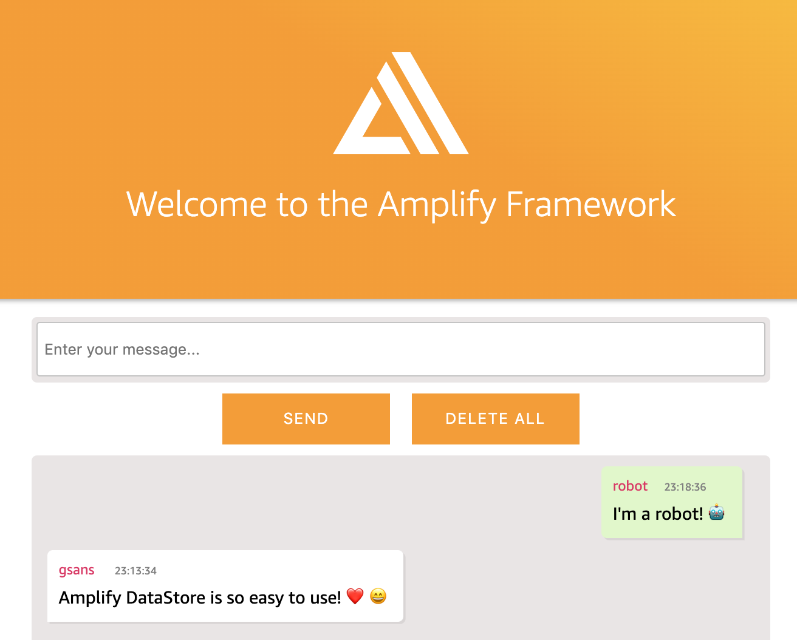

# Cloud-enabled Amplify DataStore workshop using React

In this workshop we'll learn how to use Amplify DataStore to create `Chatty` a chat app using React & [AWS Amplify](https://aws-amplify.github.io/).

 

### Topics we'll be covering:

- [Authentication](#adding-authentication)
- [GraphQL API with AWS AppSync](#adding-a-graphql-api)
- [Setup Amplify DataStore](#setup-amplify-datastore)
- [Deploying via the Amplify Console](#deploying-via-the-amplify-console)
- [Removing / Deleting Services](#removing-services)
- [Appendix and trobleshooting](#appendix)

<!-- ## Redeeming our AWS Credit   
1. Visit the [AWS Console](https://console.aws.amazon.com/console).
2. In the top right corner, click on __My Account__.

3. In the left menu, click __Credits__.
 -->

## Pre-requisites

- Node: `13.12.0`. Visit [Node](https://nodejs.org/en/download/current/)
- npm: `6.14.4`. Packaged with Node otherwise run upgrade

```bash
npm install -g npm
```

## Getting Started - Creating the React Application

To get started, we first need to create a new React project & change into the new directory using the [Create React App CLI](https://github.com/facebook/create-react-app).

If you already have this installed, skip to the next step. If not, either install the CLI & create the app or create a new app using npx:

```bash
npm install -g create-react-app
create-react-app amplify-datastore
```

Or use npx to create a new app:

```bash
npx create-react-app amplify-datastore
```

Now change into the new app directory & install the AWS Amplify & AWS Amplify React libraries:

```bash
cd amplify-datastore
npm install --save aws-amplify aws-amplify-react moment
```

> If you have issues related to EACCESS try using sudo: `sudo npm <command>`.

## Installing the CLI & Initializing a new AWS Amplify Project

### Installing the CLI

Next, we'll install the AWS Amplify CLI:

```bash
npm install -g @aws-amplify/cli
```

Now we need to configure the CLI with our credentials:

```js
amplify configure
```

> If you'd like to see a video walkthrough of this configuration process, click [here](https://www.youtube.com/watch?v=fWbM5DLh25U).

Here we'll walk through the `amplify configure` setup. Once you've signed in to the AWS console, continue:
- Specify the AWS Region: __eu-west-2 (London)__
- Specify the username of the new IAM user: __amplify-workshop-user__
> In the AWS Console, click __Next: Permissions__, __Next: Tags__, __Next: Review__, & __Create User__ to create the new IAM user. Then, return to the command line & press Enter.
- Enter the access key of the newly created user:   
  accessKeyId: __(<YOUR_ACCESS_KEY_ID>)__   
  secretAccessKey:  __(<YOUR_SECRET_ACCESS_KEY>)__
- Profile Name: __amplify-workshop-user__

### Initializing A New Project

```bash
amplify init
```

- Enter a name for the project: __amplifydatastore__
- Enter a name for the environment: __dev__
- Choose your default editor: __Visual Studio Code (or your default editor)__   
- Please choose the type of app that you're building __javascript__   
- What javascript framework are you using __react__   
- Source Directory Path: __src__   
- Distribution Directory Path: __build__   
- Build Command: __npm run-script build__   
- Start Command: __npm run-script start__   
- Do you want to use an AWS profile? __Y__
- Please choose the profile you want to use: __amplify-workshop-user__

Now, the AWS Amplify CLI has iniatilized a new project and you will see a new folder: __amplify__ and a new file called `aws-exports.js` in the __src__ directory. The files in this folder hold your project configuration.

```bash
<amplify-app>
    |_ amplify
      |_ .config
      |_ #current-cloud-backend
      |_ backend
      team-provider-info.json
```


## Adding Authentication

In order to display the user sending messages for our chat, we will require users to register and login. We can implement this requirement using the `auth` category.

To add authentication, we can use the following command:

```sh
amplify add auth
```
> When prompted choose 
- Do you want to use default authentication and security configuration?: __Default configuration__
- How do you want users to be able to sign in when using your Cognito User Pool?: __Username__
- Do you want to configure advanced settings? __Yes, I want to make some additional changes.__
- What attributes are required for signing up? (Press &lt;space&gt; to select, &lt;a&gt; to 
toggle all, &lt;i&gt; to invert selection): __Email__
- Do you want to enable any of the following capabilities? (Press &lt;space&gt; to select, &lt;a&gt; to toggle all, &lt;i&gt; to invert selection): __None__

> To select none just press `Enter` in the last option.

Now, we'll run the push command and the cloud resources will be created in our AWS account.

```bash
amplify push

Current Environment: dev

| Category | Resource name      | Operation | Provider plugin   |
| -------- | ------------------ | --------- | ----------------- |
| Auth     | amplifyappuuid     | Create    | awscloudformation |
? Are you sure you want to continue? Yes
```

To quickly check your newly created __Cognito User Pool__ you can run

```bash
amplify status
```

> To access the __AWS Cognito Console__ at any time, go to the dashboard at [https://console.aws.amazon.com/cognito/](https://console.aws.amazon.com/cognito/). Also be sure that your region is set correctly.

### Configuring the React application

Now, our resources are created & we can start using them!

The first thing we need to do is to configure our React application to be aware of our new AWS Amplify project. We can do this by referencing the auto-generated `aws-exports.js` file that is now in our src folder.

To configure the app, open __src/index.js__ and add the following code below the last import:

```js
import Amplify from 'aws-amplify'
import config from './aws-exports'
Amplify.configure(config)
```

Now, our app is ready to start using our AWS services.

### Using the withAuthenticator component

To add authentication, we'll go into __src/App.js__ and first import the `withAuthenticator` HOC (Higher Order Component) from `aws-amplify-react`:

### src/App.js

```js
import { withAuthenticator } from 'aws-amplify-react'
```

Next, we'll wrap our default export (the App component) with the `withAuthenticator` HOC:

```js
export default withAuthenticator(App, { includeGreetings: true })
```

```sh
# run the app

npm start
```

Now, we can run the app and see that an Authentication flow has been added in front of our App component. This flow gives users the ability to sign up & sign in.

> To view the new user that was created in Cognito, go back to the dashboard at [https://console.aws.amazon.com/cognito/](https://console.aws.amazon.com/cognito/). Also be sure that your region is set correctly.

### Accessing User Data

We can access the user's info now that they are signed in by calling `Auth.currentAuthenticatedUser()`.

### src/App.js

```js
import React, { useEffect } from 'react'
import { Auth } from 'aws-amplify'

function App() {
  useEffect(() => {
    Auth.currentAuthenticatedUser()
      .then(user => console.log({ user })
  })
  return (
    <div className="App">
      <p>
        Edit <code>src/App.js</code> and save to reload.
      </p>
    </div>
  )
}

export default withAuthenticator(App, { includeGreetings: true })
```

## Adding a GraphQL API

To add a GraphQL API, we can use the following command:

```sh
amplify add api
```

Answer the following questions

- Please select from one of the below mentioned services: __GraphQL__   
- Provide API name: __chattyAPI__   
- Choose an authorization type for the API __API key__   
- Enter a description for the API key: __API description__
- After how many days from now the API key should expire (1-365): __7__
- Do you want to configure advanced settings for the GraphQL API? __Yes, I want to make some additional changes__
- Configure additional auth types? __N__
- Configure conflict detection? __Y__
- Select the default resolution strategy __Auto Merge__
- Do you want to override default per model settings? __N__
- Do you have an annotated GraphQL schema? __N__ 
- Do you want a guided schema creation? __Y__   
- What best describes your project: __Single object with fields (e.g. “Todo” with ID, name, description)__   
- Do you want to edit the schema now? __Y__   

> When prompted, update the schema to the following:   

```graphql
type Chatty @model {
  id: ID!
  user: String!
  message: String!
  createdAt: AWSDateTime
}
```

This will allow us to display each user messages together with the creation date and time.

> Next, let's push the configuration to our account:

```bash
amplify push
```

- Do you want to generate code for your newly created GraphQL API __Y__
- Choose the code generation language target: __javascript__
- Enter the file name pattern of graphql queries, mutations and subscriptions: __(src/graphql/**/*.js)__
- Do you want to generate/update all possible GraphQL operations - queries, mutations and subscriptions? __Y__
- Enter maximum statement depth [increase from default if your schema is deeply nested] __2__

To view the service you can run the `console` command the feature you'd like to view:

```sh
amplify console api
```

## Setup Amplify DataStore

### Installing the Amplify DataStore

Next, we'll install the necessary dependencies:

```bash
npm install --save @aws-amplify/core @aws-amplify/datastore
```

### Data Model Generation

Next, we'll generate the models to access our messages from our __ChattyAPI__

```bash
amplify codegen models
```

> Important: DO NOT forget to generate models every time you introduce a change in your schema.

Now, the AWS Amplify CLI has generated the necessary data models and you will see a new folder in your source: __models__. The files in this folder hold your data model classes and schema.

```bash
<amplify-app>
    |_ src
      |_ models
```

### Creating a message

Now that the GraphQL API and Data Models are created we can begin interacting with them!

The first thing we'll do is create a new message using the generated Data Models and save.

```js
import { DataStore } from "@aws-amplify/datastore";
import { Chatty } from "./models";

await DataStore.save(
  new Chatty({
    user: "amplify-user",
    message: "Hi everyone!"
  })
)
```

This will create a record locally in your browser and synchronise it in the background using the underlying GraphQL API. 

### Querying data

Let's now see how we can query data using Amplify DataStore. In order to query our Data Model we will use a query and a predicate to indicate that we want all records. 

```js
import { DataStore, Predicates } from "@aws-amplify/datastore";
import { Chatty } from "./models";

const messages = await DataStore.query(Chatty, Predicates.ALL);
```

This will return an array of messages that we can display in our UI.

Predicates also support filters for common types like Strings, Numbers and Lists.

> Find all supported filters at [Query with Predicates](https://aws-amplify.github.io/docs/js/datastore#query-with-predicates)

## Creating the UI

 Now, let's look at how we can create the UI to create and display messages for our chat. We will use `useReducer` hook to keep our state.

```js
import React, { useEffect, useReducer } from 'react'
import './App.css';
import { withAuthenticator } from 'aws-amplify-react'
import { Auth } from 'aws-amplify'
import { DataStore, Predicates } from "@aws-amplify/datastore";
import { Chatty } from "./models";
import moment from 'moment'

const initialState = {
  username: "",
  messages: [],
  message: ""
}

function reducer(state, action) {
  switch(action.type) {
    case 'setUser':
      return { ...state, username: action.username }
    case 'set':
      return { ...state, messages: action.messages }
    case 'add':
      return { ...state, messages: [ ...state.messages, action.message ] }
    case 'updateInput':
      return { ...state, [action.inputValue]: action.value }
    default: new Error()
  }
}

async function getMessages(dispatch) {
  try {
    const messagesData = await DataStore.query(Chatty, Predicates.ALL);
    const sorted = [...messagesData].sort((a, b) => -a.createdAt.localeCompare(b.createdAt))
    dispatch({ type: 'set', messages: sorted })
  } catch (err) {
    console.log('error fetching messages...', err)
  }
}

async function createMessage(state, dispatch) {
  if (state.message === '') return;
  try {
    await DataStore.save(
      new Chatty({
        user: state.username,
        message: state.message
      })
    );
    state.message = '';
    getMessages(dispatch);
  } catch (err) {
    console.log('error creating message...', err)
  }
}

function updater(value, inputValue, dispatch) {
  dispatch({ type: 'updateInput', value, inputValue })
}

function App() {
  const [state, dispatch] = useReducer(reducer, initialState)

  useEffect(() => {
    Auth.currentAuthenticatedUser().then(user => {
      dispatch({ type: 'setUser', username: user.username })
    })
    getMessages(dispatch)
  }, [])

  return (
    <div className="app">
      <div>
        <input
          type="text" placeholder="Enter your message..."
          onChange={ e => updater(e.target.value, 'message', dispatch) }
          value={ state.message }
        />
        <button onClick={() => createMessage(state, dispatch)}>Create Message</button>
        { state.messages.map((message, index) => (
          <div key={ message.id }>
            <div> { message.user }</div>
            <div> { message.message }</div>
            <div> { moment(message.createdAt).format('HH:mm:ss')}</div>
          </div>
        ))}
      </div>
    </div>
  );
}

export default withAuthenticator(App, { includeGreetings: true })
```

## Deleting all messages

One of the main advantages of working using Amplify DataStore is being able to run batch mutations without having to use a series of individual operations. 

See below how we can use delete together with a predicate to remove all messages.

```js
await DataStore.delete(Chatty, Predicates.ALL);
```

### GraphQL Subscriptions

Next, let's see how we can create a subscription to subscribe to changes of data in our API.

To do so, we need to define the subscription, listen for the subscription, & update the state whenever a new piece of data comes in through the subscription.

```js
// subscribe in useEffect
  useEffect(() => {
    Auth.currentAuthenticatedUser().then(user => {
      dispatch({ type: 'setUser', username: user.username })
    })
    getMessages(dispatch)

    const subscription = DataStore.observe(Chatty).subscribe(msg => {
      console.log(msg.model, msg.opType, msg.element);
      getMessages(dispatch)
    });
    return () => subscription.unsubscribe();
  }, [])
```

## Deploying via the Amplify Console

For hosting, we can use the [Amplify Console](https://aws.amazon.com/amplify/console/) to deploy the application.

The first thing we need to do is [create a new GitHub repo](https://github.com/new) for this project. Once we've created the repo, we'll copy the URL for the project to the clipboard & initialize git in our local project:

```sh
git init

git remote add origin git@github.com:username/project-name.git

git add .

git commit -m 'initial commit'

git push origin master
```

Next we'll visit the Amplify Console in our AWS account at [https://eu-west-2.console.aws.amazon.com/amplify/home](https://eu-west-2.console.aws.amazon.com/amplify/home).

Here, we'll click __Get Started__ to create a new deployment. Next, authorize Github as the repository service.

Next, we'll choose the new repository & branch for the project we just created & click __Next__.

In the next screen, we'll create a new role & use this role to allow the Amplify Console to deploy these resources & click __Next__.

Finally, we can click __Save and Deploy__ to deploy our application!

Now, we can push updates to Master to update our application.

## Removing Services

If at any time, or at the end of this workshop, you would like to delete a service from your project & your account, you can do this by running the `amplify remove` command:

```sh
amplify remove auth

amplify push
```

If you are unsure of what services you have enabled at any time, you can run the `amplify status` command:

```sh
amplify status
```

`amplify status` will give you the list of resources that are currently enabled in your app.

## Deleting entire project

```sh
amplify delete
```

## Appendix

### Setup your AWS Account

In order to follow this workshop you need to create and activate an Amazon Web Services account. 

Follow the steps [here](https://aws.amazon.com/premiumsupport/knowledge-center/create-and-activate-aws-account)

### Trobleshooting

> Message: The AWS Access Key Id needs a subscription for the service

Solution: Make sure you are subscribed to the free plan. [Subscribe](https://portal.aws.amazon.com/billing/signup?type=resubscribe#/resubscribed)


> Message: TypeError: fsevents is not a constructor

Solution: `npm audit fix --force`

> Behaviour: data seems not to be synchronising with the cloud and or viceversa

Solution: 

```
amplify update api
amplify push
```

Make sure you answer the following questions as
- Configure conflict detection? __Y__
- Select the default resolution strategy __Auto Merge__
- Do you want to override default per model settings? __N__